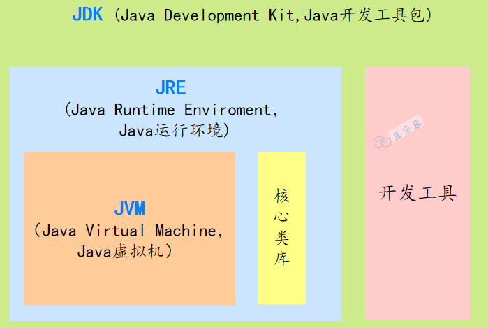
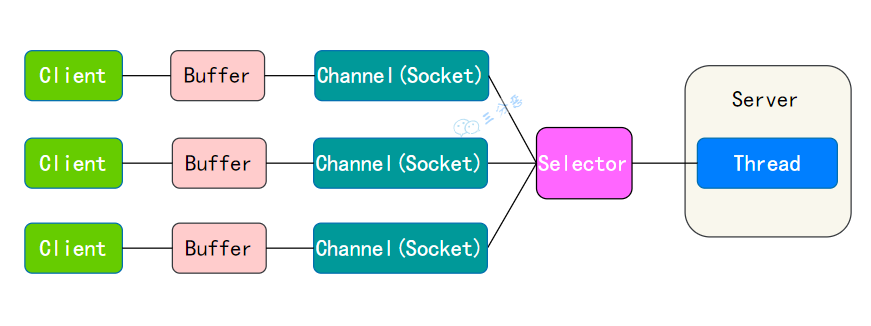

## JDK JRE JVM 关系


## 为什么说 Java 语言“编译与解释并存”？

高级编程语言按照程序的执行方式分为编译型和解释型两种。

- 编译型语言是指编译器针对特定的操作系统将源代码一次性翻译成可被该平台执行的机器码，不能跨平台。

- 解释型语言是指解释器对源程序逐行解释成特定平台的机器码并立即执行，一次编写，到处执行。


Java 语言既具有编译型语言的特征，也具有解释型语言的特征，因为 Java 程序要经过先编译，后解释两个步骤。

由 Java 编写的程序需要先经过编译步骤，生成字节码（\*.class 文件），这种字节码必须再经过 JVM，解释成操作系统能识别的机器码，在由操作系统执行。


因此，我们可以认为 Java 语言编译与解释并存。

## 重载（overload）和重写（override）的区别？

方法的重载和重写都是实现多态的方式，区别在于前者实现的是编译时的多态性，而后者实现的是运行时的多态性。

重载发生在一个类中，同名的方法如果有不同的参数列表（参数类型不同、参数个数不同或者二者都不同）则视为重载；

重写发生在子类与父类之间，重写要求子类被重写方法与父类被重写方法有相同的返回类型，比父类被重写方法更好访问，不能比父类被重写方法声明更多的异常（里氏代换原则）。

方法重载的规则：

- 方法名一致，参数列表中参数的顺序，类型，个数不同。
- 重载与方法的返回值无关，存在于父类和子类，同类中。
- 可以抛出不同的异常，可以有不同修饰符。

## 抽象类(abstract class)和接口(interface)有什么区别？

1. 接口的方法默认是public，所有方法在接口中不能有实现(Java8开始接口方法可以有默认实现），而抽象类可以有非抽象的方法。

2. 接口中除了static、final变量，不能有其他变量，而抽象类中则不⼀定。

3. ⼀个类可以实现多个接口，但只能实现⼀个抽象类。接口自己本身可以通过extends关键字扩展多个接口。

4. 接口方法默认修饰符是public，抽象方法可以有public、protected和default这些修饰符（抽象方法就是为了被重写所以不能使用private关键字修饰）。

5. 从设计层面来说，抽象是对类的抽象，是⼀种模板设计，而接口是对行为的抽象，是⼀种行为的规范。

注意jdk7~jdk9中接口的变化：

- 在 jdk 7 或更早版本中，接口里面只能有常量变量和抽象方法。这些接口方法必须由选择实现接口的类实现。
- jdk 8 的时候接口可以有默认方法和静态方法功能。
- jdk 9 在接口中引⼊了私有方法和私有静态方法

## try和finally中的return

1. 若try中有return，而finally中无return，会先将值暂存，无论finally语句中对该值做什么处理，最终返回的都是try语句中的暂存值。另外，finally语句中执行的语句先于try的return之前执行。

2. 当try与finally语句中均有return语句，会忽略try中return，执行finally的return。注意如果try的return语句是`return ++x`，则`++x`是会执行的。

验证如下：

```java
public class TryReturnTest {
    public int test1(int x) {
        try {
            x += 1;
            return ++x;
        } catch (Exception e) {
            e.printStackTrace();
        } finally {
            x += 5;
            System.out.println("finally");
        }
        return x;
    }
    public int test2(int x) {
        try {
            x += 1;
            return ++x;
        } catch (Exception e) {
            e.printStackTrace();
        } finally {
            x += 5;
            System.out.println("finally");
            return x;
        }
    }

    public static void main(String[] args) {
        TryReturnTest test = new TryReturnTest();
        System.out.println(test.test1(0)); // finally 2
        System.out.println(test.test2(0)); // finally 7
    }
}
```

## String 和 StringBuilder、StringBuffer 的区别？

1. String：String 的值被创建后不能修改，任何对 String 的修改都会引发新的 String 对象的生成。
2. StringBuffer：跟 String 类似，但是值可以被修改，使用 synchronized 来保证线程安全。
3. StringBuilder：StringBuffer 的非线程安全版本，性能上更高一些。

在Java8 时JDK 对“+”号拼接进行了优化，String间通过"+"来拼接的方式会**被优化为基于 StringBuilder 的 append 方法**进行处理。Java 会在编译期对“+”号进行处理。

## 关于Integer

### 实例引入

```java
public static void main(String[] args) {
    Integer a = 127;
    Integer b = 127;
    Integer b1 = new Integer(127);
    System.out.println(a == b); //true
    System.out.println(b == b1);  //false

    Integer c = 128;
    Integer d = 128;
    System.out.println(c == d);  //false
}
```

解释如下：

`Integer a = 127` 这种赋值，是用到了 Integer 自动装箱的机制。自动装箱的时候会去缓存池里取 Integer 对象，没有取到才会创建新的对象。

如果整型字面量的值在-128 到 127 之间，那么自动装箱时不会 new 新的 Integer 对象，而是直接引用缓存池中的 Integer 对象，超过范围`a1 == b1`的结果是 false。

### 理解Integer缓存

因为根据实践发现大部分的数据操作都集中在值比较小的范围，因此 Integer 搞了个缓存池，默认范围是 -128 到 127，可以根据通过设置`JVM-XX:AutoBoxCacheMax=`来修改缓存的最大值，最小值改不了。

实现的原理是 int 在自动装箱的时候会调用`Integer.valueOf`，进而用到了IntegerCache。

`Integer.valueOf`就是判断下值是否在缓存范围之内，如果是的话去 IntegerCache 中取，不是的话就创建一个新的 Integer 对象。

IntegerCache 是一个静态内部类， 在静态块中会初始化好缓存值。

```java
private static class IntegerCache {
    ……
    static {
        //创建Integer对象存储
        for(int k = 0; k < cache.length; k++)
            cache[k] = new Integer(j++);
        ……
    }
}
```

## BIO、NIO、AIO

1. BIO (blocking I/O): 就是传统的 IO，同步阻塞。

2. NIO (non-blocking IO): 同步非阻塞，服务器端用一个线程处理多个连接，客户端发送的连接请求会注册到多路复用器上，多路复用器轮询到连接有 IO 请求就进行处理。NIO 的数据是面向缓冲区Buffer的，必须从 Buffer 中读取或写入。



每个 Channel 对应一个 Buffer。

Selector 对应一个线程，一个线程对应多个 Channel。

Selector 会根据不同的事件，在各个通道上切换。

Buffer 是内存块，底层是数据。

3. AIO：JDK 7 引入了 Asynchronous I/O，是异步不阻塞的 IO。在进行 I/O 编程中，常用到两种模式：Reactor 和 Proactor。Java 的 NIO 就是 Reactor，当有事件触发时，服务器端得到通知，进行相应的处理，完成后才通知服务端程序启动线程去处理，一般适用于连接数较多且连接时间较长的应用。


---

**From My Blog: [akynazh](https://akynazh.site)**.

**Over.**