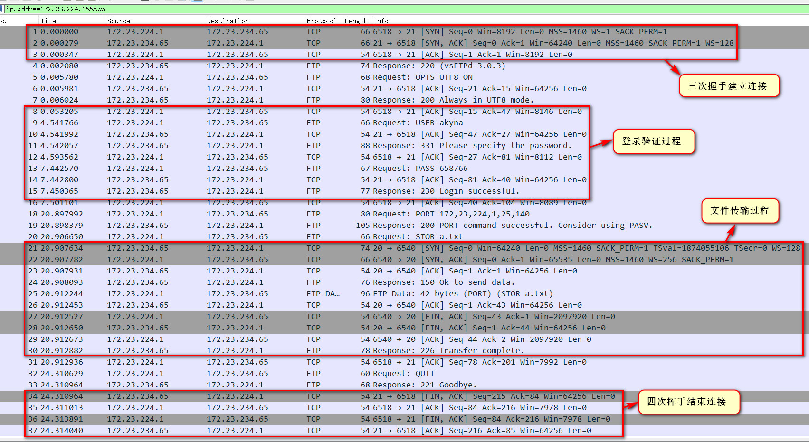
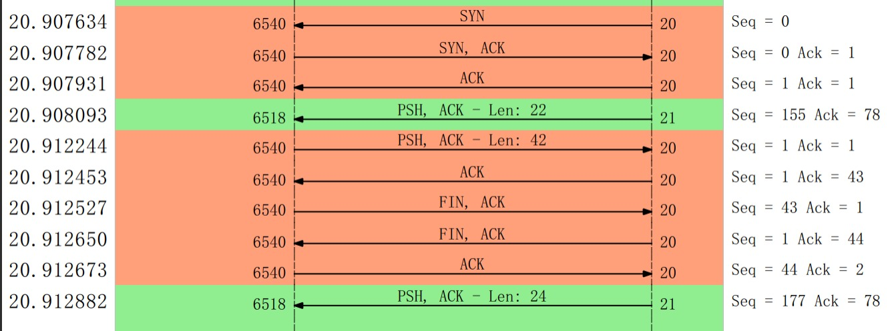
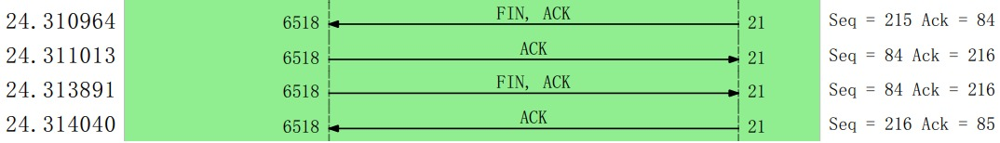

使用Wireshark作为抓包工具，通过ftp文件上传过程分析tcp原理，主要分析过程包括三次握手建立连接的过程，文件传输的过程，四次挥手断开连接的过程。

## 设备信息

1. 主机：安装了ftp的window11（ip:172.23.224.1）
2. 虚拟机：安装了vsftpd的wsl2（ubuntu18）(ip:172.23.234.65)

## 操作与分析过程

### 打开Wireshark进行捕获

1. 选择**vEthernet(WSL)**连接进行捕获。
2. 使用过滤表达式`ip.addr==172.23.234.65&&tcp`进行捕获。

### 通过ftp上传文件

```
PS C:\Users\akyna> ftp 172.23.234.65
连接到 172.23.234.65。
220 (vsFTPd 3.0.3)
200 Always in UTF8 mode.
用户(172.23.234.65:(none)): akyna
331 Please specify the password.
密码:
230 Login successful.

ftp> put a.txt
200 PORT command successful. Consider using PASV.
150 Ok to send data.
226 Transfer complete.
ftp: 发送 42 字节，用时 0.00秒 42000.00千字节/秒。
```

可见已经传输成功。

### 对捕获的数据进行分析

回到Wireshark，分析捕获的数据：



上图已经包括了三次握手建立连接，登录验证，文件传输，四次挥手结束连接这几个主要的过程。

下面通过生成流量图进行具体分析：

**（一）三次握手建立连接**


- 第一次握手：client通过6518端口向server发送连接请求，发送SYN和Seq，server在端口21进行监听并接收到请求。

- 第二次握手：server监听到请求后发送SYN，ACK和Seq，client接收到回复。

- 第三次握手：client接收到恢复后发送Seq（等于刚接收到的Ack的值）和Ack，server接收到并确认Seq正确，完成连接。

**（二）文件传输过程**



1. 首先，还是三次握手在**client端口6540和server端口20**之间建立连接，这两个端口用于传输数据；
2. 接着，server端口21回复"Response 150 Ok to send data"给client端口6518，含PSH标识，表明可以开始传输数据；
3. 然后，client开始发送数据包，长为42，且含PSH，表示可以接收数据，server接收到后**回传的Ack应该加上数据包长**，即1+42；
4. 接着，client发送了FIN标识，表明发送完毕，server发送了FIN标识，表明将停止接收，client发送ACK确定server可以停止接收；
5. 最后，client端口6518回复"Response 226 Transfer complete"给server端口21，表明传输完毕。

**（三）四次挥手结束连接**



- 第一次挥手：server发送了FIN标识，**向client确认是否可以关闭连接**；

- 第二次挥手：client接收到FIN，发送ACK，确定server可以关闭连接，这时server确定ACK正确后将进入**半关闭态**，还可以接收client发送的数据；

- 第三次挥手：这次由client发送FIN标识，**让server真的关闭连接**；

- 第四次挥手：server关闭连接，发送ACK向client确认已关闭,，至此，ftp通信完毕。

over.