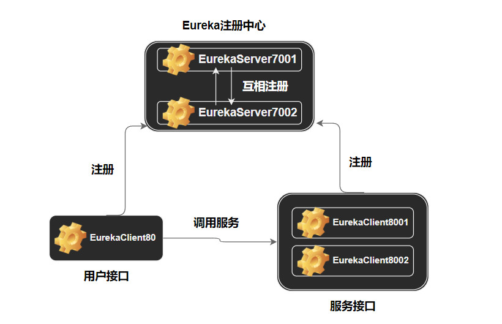
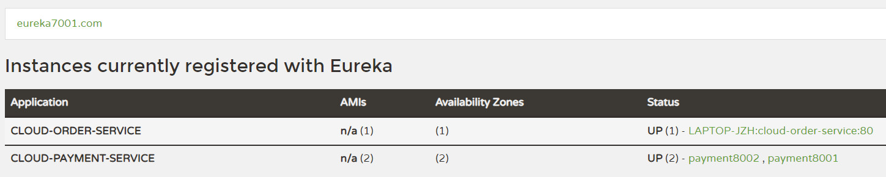

## 前言

起到微服务注册中心的作用，满足分布式系统中的AP原则，是弱一致性的。

## Eureka微服务架构图



- 服务接口采用集群模式，8001和8002端口都实现支付接口服务。
- 用户接口在运行在80端口，调用8001和8002的服务。
- 注册中心内部也采用集群模式，7001和7002端口都实现注册服务。

## 引入Eureka依赖说明

client端：

```xml
<dependency>
    <groupId>org.springframework.cloud</groupId>
    <artifactId>spring-cloud-starter-netflix-eureka-client</artifactId>
</dependency>
```

server端：

```xml
<dependency>
    <groupId>org.springframework.cloud</groupId>
    <artifactId>spring-cloud-starter-netflix-eureka-server</artifactId>
</dependency>
```

## 7001和7002端口关键配置内容

一、启动类开启注解

```java
@SpringBootApplication
@EnableEurekaServer
public class EurekaMain7001 {
    public static void main(String[] args) {
        SpringApplication.run(EurekaMain7001.class, args);
    }
}
```

二、application.yml文件配置

对于7001端口服务：（7002端口类似）

```yml
eureka:
    instance:
    hostname: eureka7001.com
    client:
    # false 表示不向注册中心注册自己
    register-with-eureka: false
    # false 表示自己端就是注册中心，我的职责就是维护服务实例，并不需要去检索服务
    fetch-registry: false
    service-url:
    # 设置与Eureka Server交互的地址查询服务和注册服务都需要依赖这个地址
        defaultZone: http://eureka7002.com:7002/eureka/
```

注意defaultZone配置指向其他注册服务端口，需满足“相互注册”。

另外，eureka7001.com和eureka7002.com其实配置指向localhost，这里只是为了模拟多台机器。


## 8001和8002端口关键配置内容

一、开启EnableEurekaClient注解

```java
@SpringBootApplication
@EnableEurekaClient
public class PaymentMain8001 {
    public static void main(String[] args) {
        SpringApplication.run(PaymentMain8001.class, args);
    }
}
```

@EnableEurekaClient表明它是一个Eureka注册客户端。

二、application.yml文件配置

eureka配置部分：

```yml
eureka:
    client:
    register-with-eureka: true # 配置是否进行注册
    fetch-registry: true # 配置是否从eureka注册中心拉取注册信息
    service-url: # 配置注册地址
        defaultZone: http://eureka7001.com:7001/eureka, http://eureka7002.com:7002/eureka
    instance:
    instance-id: payment8001
    prefer-ip-address: true # 鼠标到instance上会显示ip
```

配置服务名称：

```yml
spring:
    application:
    name: cloud-payment-service
```

这个服务名很重要，用于配置后面用户接口的服务地址。

## 80端口关键配置内容

一、开启EnableEurekaClient注解

```java
@SpringBootApplication
@EnableEurekaClient
public class OrderMain80 {
    public static void main(String[] args) {
        SpringApplication.run(OrderMain80.class, args);
    }
}
```

二、配置RestTemplate，开启负载均衡

```java
@Configuration
public class ApplicationContextConfig {
    @Bean
    @LoadBalanced // 赋予负载均衡能力
    public RestTemplate getRestTemplate() {
        return new RestTemplate();
    }
}
```

三、Controller指定负载均衡访问服务地址

```java
@RestController
@Slf4j
public class OrderController {
    public static final String PAYMENT_URL = "http://CLOUD-PAYMENT-SERVICE";

    @Resource
    private RestTemplate restTemplate;

    @GetMapping("/consumer/payment/create")
    public CommonResult<Integer> create(@RequestParam(value = "serial") String serial) {
        Payment payment = new Payment(0L, serial);
        log.info("serial: " + serial);
        return restTemplate.postForObject(PAYMENT_URL + "/payment/create", payment, CommonResult.class);
    }

    @GetMapping("/consumer/payment/get/{id}")
    public  CommonResult<Payment> getPayment(@PathVariable("id") Long id) {
        return restTemplate.getForObject(PAYMENT_URL + "/payment/get/" + id, CommonResult.class);
    }
}
```

注意：

- Controller必须是GetMapping，然后通过`restTemplate.getForObject()`或`restTemplate.postForObject()`发送get或post请求。
- 配置的服务地址前缀为http://加上服务接口对应的application-name的全大写形式。

## 效果展示

一、访问http://localhost:7001或者http://eureka7001.com:7001



可见所有服务已经成功注册。

二、访问http://localhost/consumer/payment/get/3

成功返回结果，服务端口动态变换：

```json
{
    "code":200,
    "message":"查询成功，访问端口：8001",
    "data":{"id":3,"serial":"ajefskldfa"}
}
```

```json
{
    "code":200,
    "message":"查询成功，访问端口：8002",
    "data":{"id":3,"serial":"ajefskldfa"}
}
```

---

**From My Blog: [akynazh](https://akynazh.site)**.

**Over.**