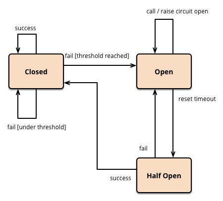
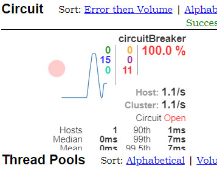

## 什么是服务熔断

### 概念

应对微服务雪崩效应的一种链路保护机制，类似保险丝。

### 关于雪崩效应

微服务之间的数据交互是通过远程调用来完成的。服务A调用服务，服务B调用服务C，某一时间链路上对服务C的调用响应时间过长或者服务C不可用，随着时间的增长，对服务C的调用也越来越多，然后服务C崩溃了，但是链路调用还在，对服务B的调用也在持续增多，然后服务B崩溃，随之A也崩溃，导致**雪崩效应**。

### 实现机制

当某服务出现不可用或响应超时的情况时，为了防止整个系统出现雪崩，暂时停止对该服务的调用。

通过Hystrix实现服务熔断，Hystrix会监控微服务间调用的状况，当失败的调用到一定阈值，就会启动熔断机制，断路器打开。而在一段时间之后，断路器会变为半开状态，此时允许部分微服务调用，如果都成功了，即不超过设定好的阈值，那么断路器将恢复为关闭状态。

如下图所示：（来自[Martin Fowler大神的博客](https://martinfowler.com/bliki/CircuitBreaker.html)）



### 应用场景

微服务架构中，多个微服务相互调用出使用

## Hystrix实现服务熔断

### 环境搭建

#### 1. 关于pom.xml

```xml
<dependency>
    <groupId>org.springframework.cloud</groupId>
    <artifactId>spring-cloud-starter-netflix-hystrix</artifactId>
</dependency>
<dependency>
    <groupId>org.springframework.cloud</groupId>
    <artifactId>spring-cloud-starter-netflix-eureka-client</artifactId>
</dependency>
```

#### 2. 启动类添加@EnableHystrix注解，表示使用熔断器。

### 实现服务熔断

#### 1. PaymentService.java

```java
public interface PaymentService {
    ...
    String circuitBreaker(Integer id);
}
```

#### 2. PaymentServiceImpl.java

设置服务熔断的核心配置：

（1）启用断路器: 

```java
@HystrixProperty(name = "circuitBreaker.enabled", value = "true")
```

（2）设置请求次数: 

```java
@HystrixProperty(name = "circuitBreaker.requestVolumeThreshold", value = "10")
```

（3）设置时间窗口期: 

```java
@HystrixProperty(name = "circuitBreaker.sleepWindowInMilliseconds", value = "10000")
```

（4）设置失败率: 

```java
@HystrixProperty(name = "circuitBreaker.errorThresholdPercentage", value = "60")
```

如上设置的值，如果在10秒内，失败率达到请求次数（10）的百分之60，也就是6次，就会打开断路器，否则断路器依然关闭。

断路器打开后，在一定时间之后，断路器变为半开状态，允许部分请求访问，如果这些请求满足要求，不超阈值，则断路器恢复为关闭状态。

```java
@Service
public class PaymentServiceImpl implements PaymentService {
    ...
    @Override
    @HystrixCommand(fallbackMethod = "circuitBreaker_fallback",
            commandProperties = {
                    @HystrixProperty(name = "circuitBreaker.enabled", value = "true"),
                    @HystrixProperty(name = "circuitBreaker.requestVolumeThreshold", value = "10"),
                    @HystrixProperty(name = "circuitBreaker.sleepWindowInMilliseconds", value = "10000"),
                    @HystrixProperty(name = "circuitBreaker.errorThresholdPercentage", value = "60")
            })
    public String circuitBreaker(Integer id) {
        if (id < 0) throw new RuntimeException("id 不能小于0");
        String uuid = IdUtil.simpleUUID();
        return Thread.currentThread().getName() + "\t" + "uuid:" + uuid;
    }
    public String circuitBreaker_fallback(@PathVariable("id") Integer id) {
        return "id 不能小于0, 请重试~ id: " + id;
    }
}
```

#### 3. PaymentController.java

```java
@RestController
@Slf4j
public class PaymentController {
    @Resource
    private PaymentService paymentService;

    @GetMapping("/payment/cir/{id}")
    public String paymentCircuitBreaker(@PathVariable("id") Integer id) {
        return paymentService.circuitBreaker(id);
    }
    ...
```

## Hystrix实现服务监控

一、在另一个module或者project中进行：

（1）关于pom.xml

除了一些基本依赖外：
```xml
<dependency>
    <groupId>org.springframework.cloud</groupId>
    <artifactId>spring-cloud-starter-netflix-hystrix-dashboard</artifactId>
</dependency>
``` 

（2）启动类开启@EnableHystrixDashboard注解。

二、在要监控的服务的配置文件中添加：

```yml
# hystrix 9001监控配置
management:
endpoints:
    web:
    exposure:
        include: hystrix.stream, info, health
```

## 测试

（一）打开：`http://{ip}:{port}/hystrix`；

（二）监控：`http://{ip}:{port}/actuator/hystrix.stream`；

（三）访问`http://localhost:8001/payment/cir/1`，可以正常访问；

（四）多次访问`http://localhost:8001/payment/cir/-1`, 返回系统繁忙信息，发现断路器开启了：



此时，再访问`http://localhost:8001/payment/cir/1`，发现返回了系统繁忙信息。

（五）多次访问`http://localhost:8001/payment/cir/1`，发现断路器关闭，恢复正常访问。

---

**From My Blog: [akynazh](https://akynazh.site)**.

**Over.**