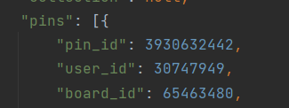
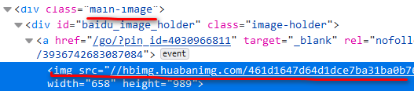
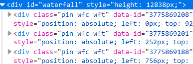
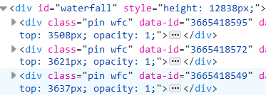

注：该项目只适用于旧版花瓣，但其中的思路值得领会。对于新版花瓣编写的代码，逻辑差别不大。

## 需要安装的库

- urllib
- easygui
- selenium
- webdriver_manager

## 获取过程

1. 进入面板内
2. 复制当前面板url
3. 启动该脚本按提示进行即可

## 代码编写流程

### 分析pin图特点

查看面板源码，可以在对应的script中找到面板中图片的json数据。

在app.page["board"]下可以找到"pins":[{...}]，主要图片ID(pin)位于这里面。



获取到图片的ID(pin)之后可以对应访问点击图片后进入的地址http://huaban.com/pins/pinId/，并获取页面源码：



显然可见主要图片的源码特征，书写对应正则表达式可以获取图片真实地址。

### 分析滚动特点

通过滚动页面我们可以发现**加载规律**：

原来的图片对应的代码：



经过滚动，原来的代码逐渐被一些新的代码取代：



而不难发现他们都有对应的**data-id**!而data-id就是图片地址中对应的**pin**。

所以我们可以通过**webdriver滚动加载页面**，**每滚动一次就进行一次data-id的读取**，并利用**集合进行去重**即可。

### 具体实现

```python
# 花瓣用户任意面板图片爬取
import urllib.request
import urllib.error
import re
import os
import datetime
import easygui
import time
from selenium import webdriver
from selenium.webdriver.chrome.service import Service
from selenium.webdriver.common import service
from webdriver_manager import driver
from webdriver_manager.chrome import ChromeDriverManager
import winsound

# 获取网页中所有图片对应的pin
def get_pins(url_, num_):
    my_options = webdriver.ChromeOptions()
    my_options.add_argument("start-maximized")
    my_options.add_argument("--ignore-certificate-errors")
    my_options.add_argument("--ignore-ssl-errors")
    my_options.add_experimental_option("excludeSwitches", ['enable-automation', 'enable-logging'])
    driver = webdriver.Chrome(service=Service(ChromeDriverManager().install()), options=my_options)
    # 如果当前chromedriver版本不对，会自动去官网下载对应的版本到~/.wdm/drivers/chromedriver里，且会有缓存，下次直接读取缓存
    driver.get(url_)

    js = "window.scrollTo(0,document.body.scrollHeight);" # js脚本实现向下滑动
    pattern = re.compile(r'data-id=?"(\d*)"')
    pins_ = set()
    # 可以使用大括号 { } 或者 set() 函数创建集合，但是注意如果创建一个空集合必须用 set() 而不是 { }，因为{}是用来表示空字典类型的。
    num = int(num_)
    tries = num / 15 + 1; # 滑动次数，每次滑动大约可以获得15张图片的pin
    while True:
        tries -= 1
        html_ = driver.page_source
        pins_1 = re.findall(pattern, html_) # 返回获取到的pin列表
        pins_2 = set(pins_1) # pin列表转化为pin集合
        pins_.update(pins_2) # 求交集，以免下载重复照片
        driver.execute_script(js)
        time.sleep(1) # 给脚本运行留足时间
        if tries < 0:
            break
    driver.close()
    return pins_


# 获取页面html
def get_html_1(url_):
    try:
        page = urllib.request.urlopen(url_)
    except urllib.error.URLError:
        return 'fail'
    html_ = page.read().decode('utf-8')
    return html_


# 下载图片
def get_image(path_, pin_list):
    success = 0
    fail = 0
    now = time.time()
    t_now = time.strftime("%Y-%m-%d_%H-%M-%S_", time.localtime(now))
    for pinId in pin_list:
        # 获取跳转网页网址
        url_str = r'http://huaban.com/pins/%s/' % pinId

        # 获取点击图片时弹出网页的源码
        pinId_source = get_html_1(url_str)
        if pinId_source == 'fail':
            continue

        # 解析源码，获取原图片的网址
        '''
        <div class="main-image"><div class="image-holder" id="baidu_image_holder">
        <img src="//hbimg.huabanimg.com/64369267b9c8dc7a43da81457658c05b1a752f9329ec0-dSfdfl_fw658/format/webp"
        '''
        img_url_re = re.compile('main-image.*?src="(.*?)"', re.S)
        img_url_list = re.findall(img_url_re, pinId_source)
        img_url = 'http:' + img_url_list[0]
        try:
            urllib.request.urlretrieve(img_url, path_ + "\\" + t_now + str(success) + ".jpg")
            # urlretrieve()方法直接将远程数据下载到本地
        except urllib.error.URLError:
            print("获取失败！%s" % img_url)
            fail += 1
            continue
        print("获取成功！%s" % img_url)
        success += 1
    print("成功获取图片张数：%d" %success)
    print("获取失败的图片张数：%d" %fail)
    winsound.Beep(frequency=250, duration=500)
    os.system("pause")


# 创建文件夹路径
def createPath():
    while True:
        path_ = easygui.diropenbox(title='选择你要保存的路径')
        filePath = path_ + "\\" + str(datetime.datetime.now().strftime('%Y-%m-%d %H.%M.%S'))

        isExists = os.path.exists(filePath)
        if not isExists:
            # 创建目录
            os.makedirs(filePath)
            print('%s创建成功！' % filePath)
            break
        else:
            print('%s已存在重新输入！' % filePath)
    return filePath


if __name__ == '__main__':
    # 用户输入数据
    values = easygui.multenterbox("获取花瓣用户任意面板中的图片", "welcome", ["面板的地址", "想下载的大概张数"])
    url = values[0]
    num = values[1]
    path = createPath()

    # 获取图片的pin
    pins = get_pins(url, num)

    # 获取并下载图片
    print('即将为主人下载%d张照片~' %len(pins))
    get_image(path, pins)

```

---

**From My Blog: [akynazh](https://akynazh.site)**.

**Over.**