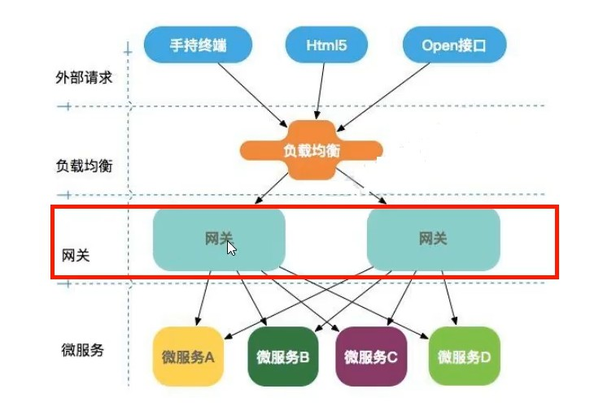

## 网关的作用

如图所示，网关介于外部请求和具体微服务之间，在不暴露内部微服务端口的情况下，通过一个或者多个指定的网关端口统一地处理外部各种请求。



## 使用SpringCloud Gateway

### 依赖引入

除了基本依赖以外，引入下列依赖：

```xml
<!-- others -->
<dependency>
    <groupId>org.springframework.cloud</groupId>
    <artifactId>spring-cloud-starter-netflix-eureka-client</artifactId>
</dependency>
<dependency>
    <groupId>org.springframework.cloud</groupId>
    <artifactId>spring-cloud-starter-gateway</artifactId>
</dependency>
```
**注意不能引入web相关依赖，因为Gateway是基于WebFlux的。**

### 文件配置

列出部分重要配置：

```yml
server:
port: 9669
cloud:
    gateway:
    discovery:
        locator:
        enabled: true # 开启从注册中心动态创建路由的功能，利用微服务名进行路由
    routes:
        - id: path_route
        uri: lb://CLOUD-PAYMENT-SERVICE # lb：负载均衡
        predicates:
            - Path=/payment/**
            - After=2022-07-26T17:33:52.449+08:00[Asia/Shanghai] # ZonedDateTime.now()
            - Cookie=username,jzh
```

注意点如下：

- 9669端口作为网关端口；
- uri中http改为了lb，用于负载均衡；
- predicates，即断言，上述断言是：
- 匹配路径：/payment/**；
- 开始允许访问时间：`ZonedDateTime.now()`（Java函数获取该格式时间）
- 携带cookie：`key=username, value=jzh`

### 过滤器配置

实现GlobalFilter, Ordered，重写方法即可：

```java
@Component
@Slf4j
public class MyGlobalFilter implements GlobalFilter, Ordered {
    @Override
    public Mono<Void> filter(ServerWebExchange exchange, GatewayFilterChain chain) {
        String username = exchange.getRequest().getQueryParams().getFirst("username");
        if (username == null) {
            log.info("username lost");
            exchange.getResponse().setStatusCode(HttpStatus.NOT_ACCEPTABLE);
            return exchange.getResponse().setComplete();
        }
        return chain.filter(exchange);
    }

    @Override
    public int getOrder() {
        return 0;
    }
}
```

定义了url中携带必须携带一个key为username的参数。

## 测试

注意先开启指定的微服务，访问`http://localhost:9669/payment/get/11?username=aaa`（同时配好cookie），成功返回结果：

```json
{
    "code": 200,
    "data": {
        "serial": "8asd8sa2j",
        "id": 11
    },
    "message": "查询成功，访问端口：8001"
}
```

再刷新，发现端口动态变化为8002，负载均衡功能也测试成功。

---

**From My Blog: [akynazh](https://akynazh.site)**.

**Over.**