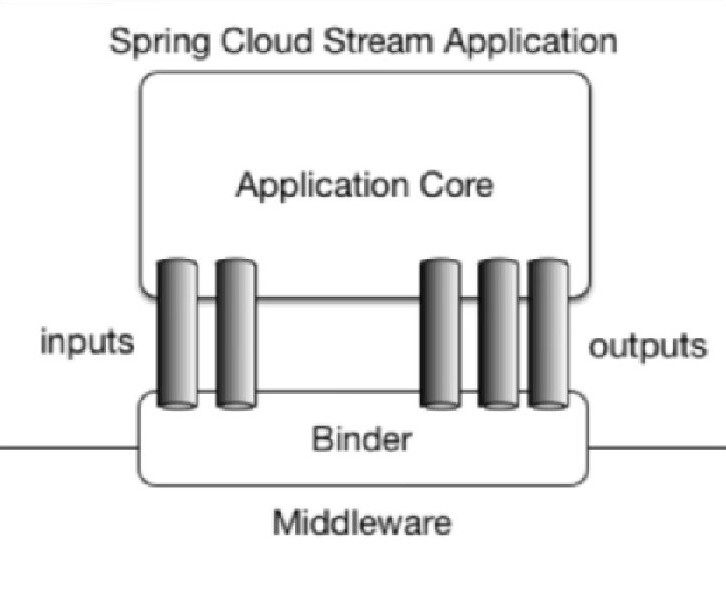

## 为何使用Stream？

实现消息的收发可以用许多种方式来实现，如Kafka，RabbitMQ等，而通过Stream可以方便地通过一个Binder对象与这些不同的实现工具对接，应用程序通过Inputs和Outputs来与Binder交互即可实现消息的收发，这样我们就只需要知道如何与Stream交互即可方便地使用消息驱动。

下图即Stream工作原理：



## Stream使用记录

### 一、依赖导入

除去一些基本依赖之外，发布端和订阅端均导入：

```xml
<dependency>
    <groupId>org.springframework.cloud</groupId>
    <artifactId>spring-cloud-starter-stream-rabbit</artifactId>
</dependency>
```

### 二、基本配置

发布端：

```yml
spring:
  cloud:
    stream:
      binders:
        defaultRabbit:
          type: rabbit
          environment:
            spring:
              rabbitmq:
                host: localhost
                port: 5672
                username: guest
                password: guest
      bindings:
        output:
          destination: myExchange
          content-type: application/json
          binder: defaultRabbit
```

订阅端：

```yml
spring:
  cloud:
    stream:
      binders:
        defaultRabbit:
          type: rabbit
          environment:
            spring:
              rabbitmq:
                host: localhost
                port: 5672
                username: guest
                password: guest
      bindings:
        input:
          destination: myExchange
          content-type: application/json
          binder: defaultRabbit
          group: jzh1
```

注意，两个订阅端如果实现同一微服务，group应该一样，这样，在同一个组内会发生竞争关系，只有其中一个可以消费（默认采用轮询的机制处理），避免了出现重复消费的问题。

### 三、发送端代码编写

（1）编写IMessageProvider接口并实现：

IMessageProvider.java:

```java
public interface IMessageProvider {
    String send();
}
```

MessageProviderImpl.java

```java
@EnableBinding(Source.class)
public class MessageProviderImpl implements IMessageProvider {
    @Resource
    private MessageChannel output;

    @Override
    public String send() {
        String s = IdUtil.simpleUUID();
        output.send(MessageBuilder.withPayload(s).build());
        return s;
    }
}
```

- Source代表为消息来源方；
- MessageChannel是应用与Binder之间建立的通道，通过它收发消息；
- send()方法处理参数为Message<?>类型。

（2）编写controller，用于发送消息：

```java
@RestController
public class SendController {
    @Resource
    private IMessageProvider messageProvider;

    @GetMapping("/msg")
    public String sendMsg() {
        return messageProvider.send();
    }
}

```

### 四、订阅端代码编写

编写controller，用于接收并打印消息：

```java
@Component
@EnableBinding(Sink.class)
public class GetController {
    @Value("${server.port}")
    private String port;

    @StreamListener(Sink.INPUT)
    public void input(Message<String> msg) {
        System.out.println("consumer(port=" +  port + "), receive msg:" + msg.getPayload());
    }
}

```

- Sink表示是消息接收方；
- 通过@StreamListener实现消息的监听。

## 测试

1. 开启RabbitMQ服务，打开图形管理界面（默认15672端口）；
2. 开启各微服务，发送端通过`/msg`接口发送消息；
3. 订阅端在控制台成功监听到消息，由于在同一组中，可见消息交替出现。


---

**From My Blog: [akynazh](https://akynazh.site)**.

**Over.**