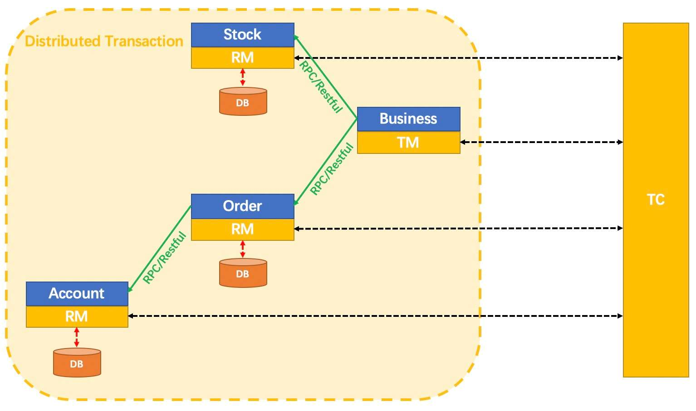

## 关于分布式事务

​分布式系统会把一个应用系统拆分为可独立部署的多个服务，因此需要服务与服务之间远程协作才能完成事务操作。

这种分布式系统环境下由不同的服务之间通过网络远程协作完成事务称之为分布式事务。

例如用户下一个订单，需要首先创建订单，然后删减库存，接着扣除用户的金钱，最后完成订单。这个过程中，每个操作都可以作为一个微服务，每个微服务操作对应的数据库，而各个数据库可能分布在不同机器上，那么分布式事务就产生了，我们要确保一个事务被正确地处理，必须解决好分布式事务的数据提交与回滚。

## 关于Seata

Seata 是一款开源的分布式事务解决方案，致力于提供高性能和简单易用的分布式事务服务。Seata 将为用户提供了 AT、TCC、SAGA 和 XA 事务模式，为用户打造一站式的分布式解决方案。（来源官网）



- TC (Transaction Coordinator) - 事务协调者：

  维护全局和分支事务的状态，驱动全局事务提交或回滚。

- TM (Transaction Manager) - 事务管理器：

  定义全局事务的范围：开始全局事务、提交或回滚全局事务。

- RM (Resource Manager) - 资源管理器：

  管理分支事务处理的资源，与TC交谈以注册分支事务和报告分支事务的状态，并驱动分支事务提交或回滚。

## 开始编码测试

### 架构说明

开启三个微服务，创建订单服务，删减库存服务，扣除用户金钱服务，均注册到nacos。

由订单服务作为入口，首先创建订单，然后删减库存，最后扣钱，完成订单，各个服务数据存取操作均处于不同数据库中。

使用seata作为分布式事务解决方案，也注册到nacos中。

### 配置Seata环境

一、下载Seata1.0.0

二、建seata表，[sql链接](https://github.com/seata/seata/blob/develop/script/server/db/mysql.sql)

三、修改配置

(1) registry.conf:

type修改为nacos

```conf
registry {
  # file 、nacos 、eureka、redis、zk、consul、etcd3、sofa
  type = "nacos"

  nacos {
    serverAddr = "localhost:8848"
    namespace = ""
    cluster = "default"
  }
...
}
```

(2) file.conf: 

my_test_tx_group修改为自定义group名，store.mode改为db，修改db配置内容。

```conf
service {
  #transaction service group mapping
  vgroup_mapping.jzh = "default"
  #only support when registry.type=file, please don't set multiple addresses
  default.grouplist = "127.0.0.1:8091"
  #disable seata
  disableGlobalTransaction = false
}

## transaction log store, only used in seata-server
store {
  ## store mode: file、db
  mode = "db"

  ## file store property
  file {
    ## store location dir
    dir = "sessionStore"
  }

  ## database store property
  db {
    ## the implement of javax.sql.DataSource, such as DruidDataSource(druid)/BasicDataSource(dbcp) etc.
    datasource = "dbcp"
    ## mysql/oracle/h2/oceanbase etc.
    db-type = "mysql"
    driver-class-name = "com.mysql.jdbc.Driver"
    url = "jdbc:mysql://127.0.0.1:3306/seata"
    user = "root"
    password = "******"
  }
}
```

四、启动seata

bin目录下：

```
.\seata-server.bat -p 8091 -h 127.0.0.1 -m db
```

### 编写微服务模块

#### 一、创建数据库表：

创建seata_order，seata_account，seata_storage三个数据库，创建对应数据表，以及undo_log表，[数据库脚本地址](https://github.com/seata/seata/blob/develop/script/client/at/db/mysql.sql)。

#### 二、微服务配置：

将file.conf和registry.conf复制到微服务对应配置文件目录下。

在application.yaml指明自定义的服务组。

```yaml
spring:
  cloud:
    alibaba:
      seata:
        tx-service-group: jzh
```

导入seata依赖（指定好自己用的seata版本）：

```xml
<dependency>
    <groupId>com.alibaba.cloud</groupId>
    <artifactId>spring-cloud-starter-alibaba-seata</artifactId>
    <exclusions>
        <exclusion>
            <artifactId>seata-all</artifactId>
            <groupId>io.seata</groupId>
        </exclusion>
    </exclusions>
</dependency>
<dependency>
    <groupId>io.seata</groupId>
    <artifactId>seata-all</artifactId>
    <version>1.0.0</version>
</dependency>
```


#### 三、多数据源配置

seata需要处理多个数据源，因此必须配置多数据源，然而DataSourceAutoConfiguration.class默认会帮我们自动配置单数据源，所以必须排除它。

启动类添加如下注解即可：

```java
@SpringBootApplication(exclude = DataSourceAutoConfiguration.class)
```

同时指定多数据源配置如下：

```java
@Configuration
public class DataSourceProxyConfig {
    @Bean
    @ConfigurationProperties(prefix = "spring.datasource")
    public DataSource druidDataSource() {
        return new DruidDataSource();
    }

    @Bean
    public DataSourceProxy dataSourceProxy(DataSource dataSource) {
        return new DataSourceProxy(dataSource);
    }

    @Bean
    public SqlSessionFactory sqlSessionFactoryBean(DataSourceProxy dataSourceProxy) throws Exception {
        SqlSessionFactoryBean sqlSessionFactoryBean = new SqlSessionFactoryBean();
        sqlSessionFactoryBean.setDataSource(dataSourceProxy);
        sqlSessionFactoryBean.setMapperLocations(new PathMatchingResourcePatternResolver().getResources("classpath:mapper/*.xml"));
        sqlSessionFactoryBean.setTransactionFactory(new SpringManagedTransactionFactory());
        return sqlSessionFactoryBean.getObject();
    }
}
```

#### 微服务代码编写

订单服务具体实现：

```java
@Service
@Slf4j
public class OrderServiceImpl implements OrderService {
    @Override
    @GlobalTransactional(name = "jzh-create", rollbackFor = Exception.class)
    public void create(Order order) {
        log.info("************开始创建订单");
        orderDao.create(order);

        log.info("************开始扣库存");
        storageService.decrease(order.getProductId(), order.getCount());
        log.info("************完成扣库存");

        log.info("************开始扣钱");
        accountService.decrease(order.getUserId(), order.getMoney());
        log.info("************扣钱完成");

        orderDao.update(order.getUserId(), 0);
        log.info("************订单完成");
    }

    @Resource
    private OrderDao orderDao;
    @Resource
    private StorageService storageService;
    @Resource
    private AccountService accountService;
}
```

rollbackFor指定为任何异常发生都回滚。

其他两个微服务通过feign调用：


AccountService.java:

```java
@FeignClient(value = "seata-account-service")
public interface AccountService {
    @PostMapping(value = "/account/decrease")
    CommonResult decrease(@RequestParam("userId") Long userId,
                          @RequestParam("money") BigDecimal money);
}
```

StorageService.java

```java
@FeignClient(value = "seata-storage-service")
public interface StorageService {
    @PostMapping(value = "/storage/decrease")
    CommonResult decrease(@RequestParam("productId") Long productId,
                          @RequestParam("count") Integer count);
}
```

其他两个微服务具体代码省略了。

OrderController:

通过/order/create请求服务：

```java
@RestController
@Slf4j
public class OrderController {
    @Resource
    private OrderService orderService;

    @PostMapping("/order/create")
    public CommonResult create(@RequestBody Order order) {
        log.info(order.toString());
        orderService.create(order);
        return new CommonResult(200, "订单创建成功");
    }
}
```

## 测试

一、访问`localhost:8848/nacos`，发现三个微服务和seata服务都已经注册成功；

二、发送`localhost:2001/order/create`请求（POST，请求体为订单信息），返回200，查看数据库表，数据变更正确；

三、手动给Account服务添加除0异常，重复如上请求，返回500，后台报异常，查看库存数据库表，发现存量没有变化，证明回滚成功。

---

**From My Blog: [akynazh](https://akynazh.site)**.

**Over.**